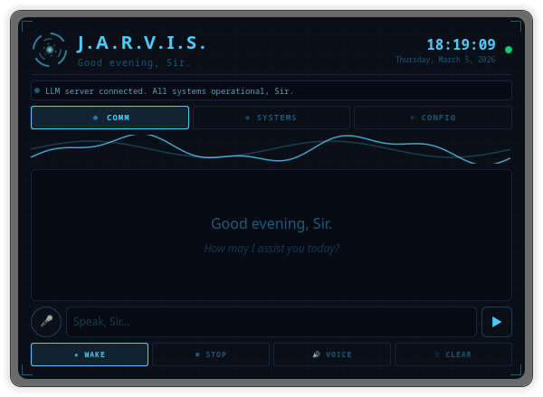
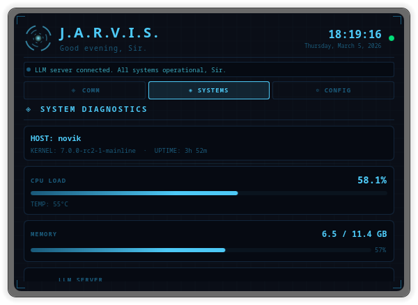
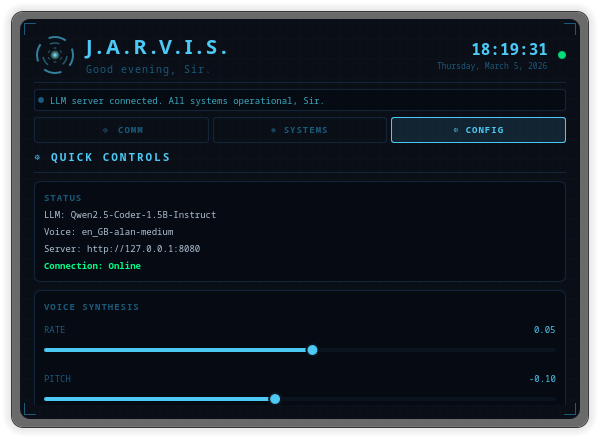
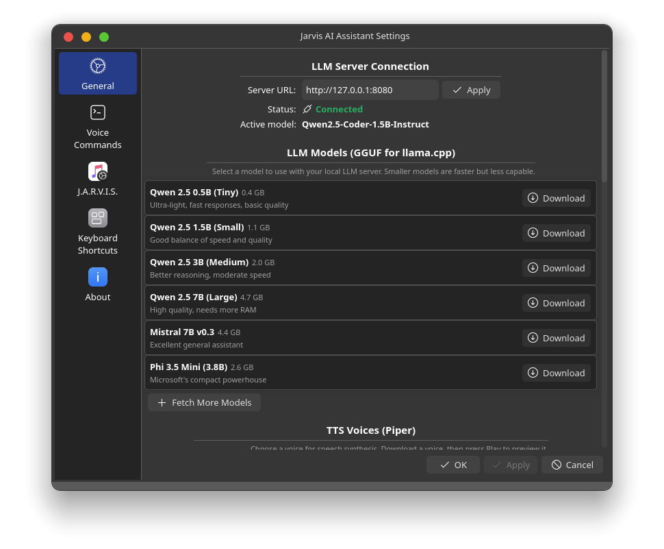
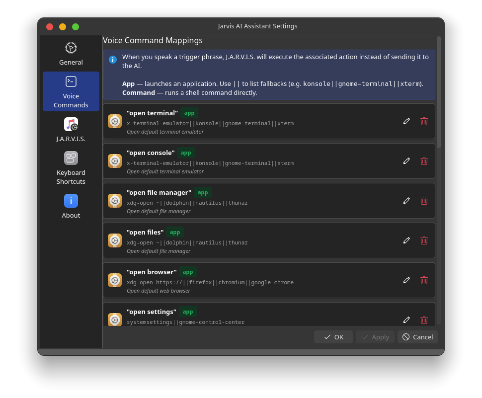
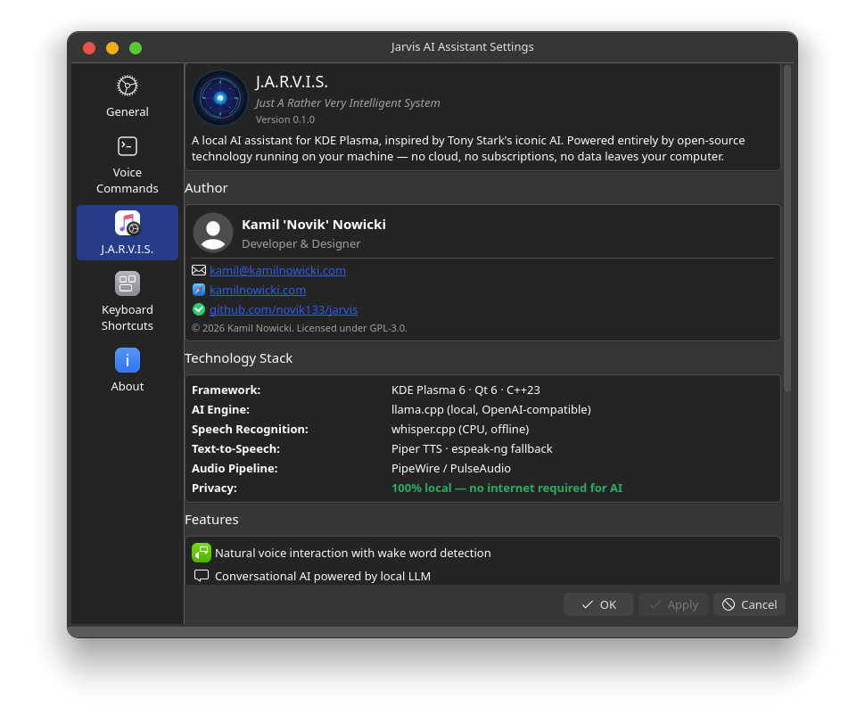

<p align="center">
  
  
  
  
  
</p>

<h1 align="center">J.A.R.V.I.S.</h1>
<h3 align="center">Just A Rather Very Intelligent System</h3>

<p align="center">
  <strong>A fully local AI assistant for KDE Plasma 6, inspired by Tony Stark's iconic AI.</strong><br>
  Powered by open-source LLM, speech recognition, and text-to-speech — 100% offline, 100% private.
</p>

<p align="center">
  <a href="https://github.com/novik133/jarvis/releases"></a>
  <a href="https://github.com/novik133/jarvis/issues"></a>
  <a href="https://github.com/novik133/jarvis/stargazers"></a>
  <a href="https://github.com/novik133/jarvis"></a>
</p>

---

## Screenshots

<table>
  <tr>
    <td align="center" width="33%">
      <br>
      <sub><b>COMM</b> — Chat Interface</sub>
    </td>
    <td align="center" width="33%">
      <br>
      <sub><b>SYSTEMS</b> — Diagnostics</sub>
    </td>
    <td align="center" width="33%">
      <br>
      <sub><b>CONFIG</b> — Quick Controls</sub>
    </td>
  </tr>
  <tr>
    <td align="center" width="33%">
      <br>
      <sub><b>Settings</b> — LLM & Models</sub>
    </td>
    <td align="center" width="33%">
      <br>
      <sub><b>Settings</b> — Voice Commands</sub>
    </td>
    <td align="center" width="33%">
      <br>
      <sub><b>Settings</b> — J.A.R.V.I.S.</sub>
    </td>
  </tr>
</table>

---

## Features

| Feature | Description |
|---------|-------------|
| **Local LLM Chat** | Conversational AI via llama.cpp — no cloud, no API keys |
| **Wake Word** | Say "Jarvis" to activate voice commands (whisper.cpp, CPU-only) |
| **Voice Commands** | 14 built-in commands + fully customizable mappings |
| **System Interaction** | LLM can open apps, run commands, write files, type text |
| **Text-to-Speech** | Piper TTS with downloadable voices (espeak-ng fallback) |
| **System Monitor** | Real-time CPU, RAM, temperature, uptime display |
| **Timers & Reminders** | Quick presets and custom timers with audio alerts |
| **Iron Man HUD** | Arc reactor animation, waveform visualizer, holographic UI |
| **Privacy First** | Everything runs locally — no data ever leaves your machine |

## Requirements

### System Dependencies

```bash
# Arch Linux / Manjaro
sudo pacman -S qt6-base qt6-declarative qt6-multimedia qt6-speech \
  plasma-framework extra-cmake-modules ki18n piper-tts pipewire xdotool

# Fedora
sudo dnf install qt6-qtbase-devel qt6-qtdeclarative-devel qt6-qtmultimedia-devel \
  qt6-qtspeech-devel plasma-framework-devel extra-cmake-modules kf6-ki18n-devel \
  piper pipewire xdotool

# Ubuntu / Kubuntu (24.04+)
sudo apt install qt6-base-dev qt6-declarative-dev qt6-multimedia-dev qt6-speech-dev \
  libplasma-dev extra-cmake-modules libkf6i18n-dev piper pipewire xdotool
```

### whisper.cpp Model

Download the tiny English model for wake word detection:

```bash
mkdir -p ~/.local/share/jarvis
wget -O ~/.local/share/jarvis/ggml-tiny.en.bin \
  https://huggingface.co/ggerganov/whisper.cpp/resolve/main/ggml-tiny.en.bin
```

### LLM Server

J.A.R.V.I.S. connects to a local [llama.cpp](https://github.com/ggerganov/llama.cpp) server:

```bash
# Download a model (example: Qwen2.5 1.5B)
# Then start the server:
llama-server -m your-model.gguf --port 8080
```

Or download models directly from the plasmoid settings.

## Installation

### Build from Source

```bash
git clone https://github.com/novik133/jarvis.git
cd jarvis

mkdir build && cd build
cmake .. -DCMAKE_INSTALL_PREFIX=/usr
make -j$(nproc)
sudo make install

# Restart Plasma
plasmashell --replace &
```

### Add to Panel

1. Right-click your Plasma panel
2. **Add Widgets...** > Search for **"Jarvis"**
3. Drag it to your panel or desktop
4. Right-click the widget > **Configure** to set up LLM server and download voices

## Configuration

Right-click the J.A.R.V.I.S. widget > **Configure** to access:

### General
- LLM server URL and model selection
- TTS voice selection and download
- Speech rate, pitch, and volume
- Wake word and audio settings
- Conversation memory length
- AI personality customization

### Voice Commands
- View and edit all voice command mappings
- Add custom commands (app launchers or shell commands)
- Reset to defaults

### Advanced System Interaction

J.A.R.V.I.S. can interact with your system through natural language:

```
"Jarvis, open the terminal and run htop"
"Jarvis, create a file on my desktop called notes.md with today's meeting notes"
"Jarvis, open Kate and write a Python hello world script"
"Jarvis, what's my CPU temperature?"
```

The LLM generates structured action blocks that the backend executes:
- **run_command** — execute shell commands silently
- **open_terminal** — open a terminal with a command
- **write_file** — create files with content
- **open_app** — launch GUI applications
- **open_url** — open URLs in browser
- **type_text** — type text into the focused window

## Architecture

```
src/plugin/
  jarvisbackend.h/.cpp        Coordinator — composes all modules
  jarvisplugin.h/.cpp         QML plugin registration
  settings/
    jarvissettings.h/.cpp     Persistence, model/voice lists, downloads
  tts/
    jarvisTts.h/.cpp          Piper TTS + espeak-ng fallback
  audio/
    jarvisaudio.h/.cpp        Audio capture, whisper.cpp, transcription
  system/
    jarvissystem.h/.cpp       CPU/RAM/temp monitoring, clock
  commands/
    jarviscommands.h/.cpp     Voice command mappings
package/
  metadata.json               Plasma applet metadata
  contents/
    ui/main.qml               Main widget UI
    ui/configGeneral.qml      General settings page
    ui/configCommands.qml     Voice commands settings page
    ui/configAbout.qml        About page
    config/config.qml         Configuration tab model
```

## Resource Usage

J.A.R.V.I.S. is designed to be lightweight:

| Component | Memory | CPU (idle) | Notes |
|-----------|--------|------------|-------|
| Plugin (C++ backend) | ~15 MB | <1% | Modular, lazy initialization |
| Whisper (wake word) | ~40 MB | ~2% | tiny.en model, 2 threads, 512 audio context |
| Piper TTS | ~0 MB idle | 0% idle | Spawns only when speaking, exits after |
| LLM Server | Separate | Separate | Not part of the plugin — user manages |

- Whisper runs in a background thread, never blocks the UI
- Piper TTS is a one-shot process per utterance (no persistent daemon)
- Audio buffer has amplitude threshold — whisper skips silent frames
- System monitor polls every 3 seconds (minimal /proc reads)

## Contributing

Contributions are welcome! Please:

1. Fork the repository
2. Create a feature branch (`git checkout -b feature/amazing-feature`)
3. Commit your changes (`git commit -m 'Add amazing feature'`)
4. Push to the branch (`git push origin feature/amazing-feature`)
5. Open a Pull Request

## License

This project is licensed under the **GNU General Public License v3.0** — see the [LICENSE](LICENSE) file for details.

## Author

**Kamil 'Novik' Nowicki**

- Website: [kamilnowicki.com](https://kamilnowicki.com)
- GitHub: [github.com/novik133](https://github.com/novik133)
- Email: [kamil@kamilnowicki.com](mailto:kamil@kamilnowicki.com)

## Support

If you find J.A.R.V.I.S. useful, consider supporting its development:

[](https://paypal.me/noviktech133)

---

<p align="center">
  <em>"At your service, Sir. All systems nominal."</em>
</p>

<p align="center">
  Copyright &copy; 2026 Kamil Nowicki. All rights reserved.
</p>
